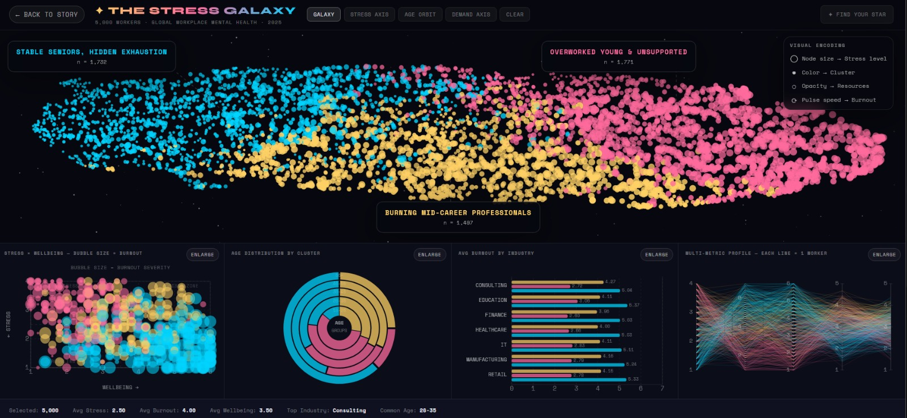
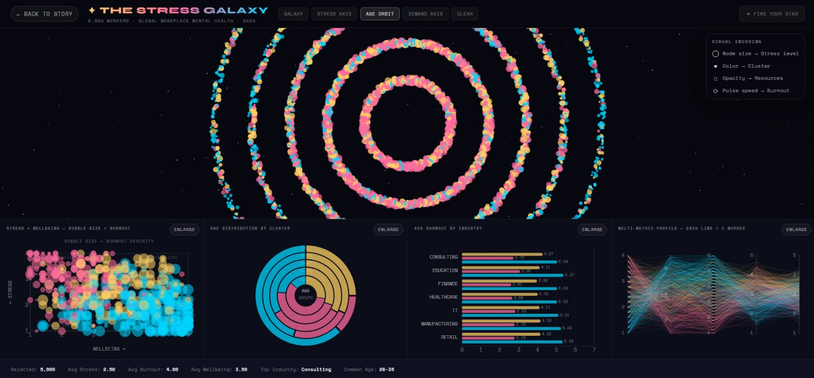
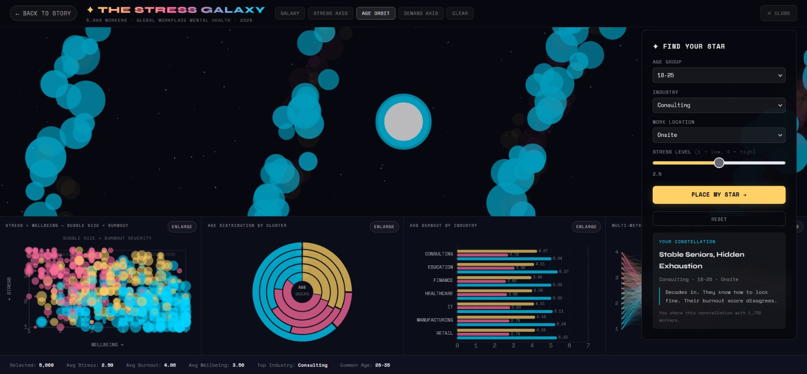
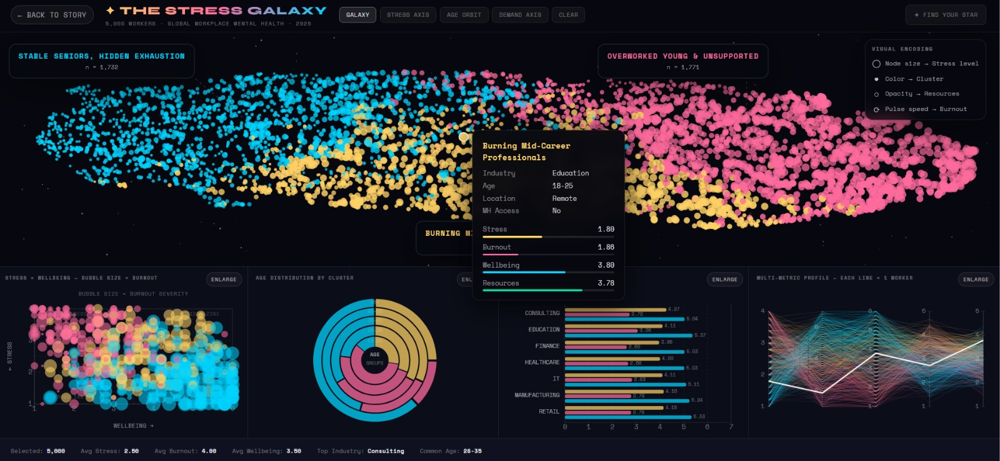
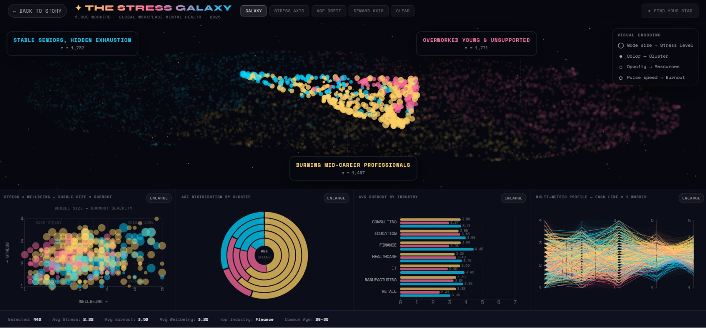
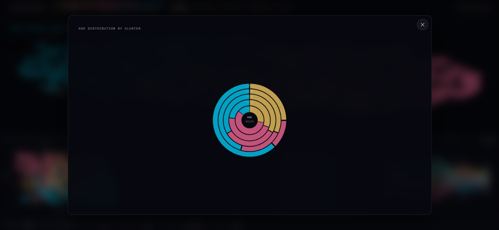

# ✦ The Stress Galaxy
**ECS272 Information Visualization · UC Davis · Winter 2026**  
Akanksha Kulkarni · Hemang Singh · Ishika Bhaumik

---
[//]: # (Screenshots section)
---

## Screenshots

Below are some key screenshots from the project interface:

| Overview | Age Orbit | Find Your Star |
|---|---|---|
|  |  |  |

| Hover | Lasso | Ring Chart |
|---|---|---|
|  |  |  |

An interactive narrative visualization of global workplace mental health across **5,000 workers**.

Each worker is rendered as a star. Three clusters of similar workers form constellations. The visualization lets you explore who is stressed, who is burned out, and — most importantly — why those two things are not the same.

**Central finding:** The senior worker cluster has the *lowest* average stress score and the *highest* average burnout score in the dataset. Workers who have learned to look fine are paying a hidden price.

---

## Two Experiences

| Page | Purpose | How to navigate |
|---|---|---|
| `index.html` | Guided story — 5-act narrative over the galaxy | Click the **→** arrow or nav dots at the bottom to advance |
| `explore.html` | Free exploration — full interaction unlocked | Use toolbar buttons, lasso, zoom, and the right-side panels |

---

## Setup

### 1. Python environment
```bash
python3 -m venv .venv
source .venv/bin/activate        # Windows: .venv\Scripts\activate
pip install -r requirements.txt
```

`requirements.txt` includes: `pandas`, `numpy`, `scikit-learn`, `umap-learn`, `matplotlib`, `seaborn`, `jupyter`

### 2. Build processed data

Run from the repo root:
```bash
python python/process.py    # generates the 3 JSON files
python python/validate.py   # verifies schema + integrity
```

This produces:
- `data/processed/workers.json` — 5,000 worker nodes with UMAP coordinates, metrics, and top-5 similarity neighbors
- `data/processed/clusters.json` — 3 cluster profiles with averages and demographic breakdowns
- `data/processed/similarity.json` — per-worker cosine similarity neighbor lists

> **Note:** Pre-built JSON files are committed to the repo. You only need to re-run `process.py` if you want to regenerate from the raw CSV.

### 3. Run locally
```bash
python3 -m http.server 8000
```

Then open:
- **Story mode:** `http://localhost:8000/index.html`
- **Explore mode:** `http://localhost:8000/explore.html`

> ⚠️ Must be served over HTTP — the browser `fetch()` calls for JSON will fail if opened as `file://`.

---

## Suggested Walkthrough for Graders

To see the full project in ~5 minutes:

1. **Open `index.html`** — click the arrow 4–5 times to step through the narrative. Notice how the galaxy reconfigures at each act and cluster annotations appear.

2. **Click "Enter the Galaxy"** (top-right gold button) to open `explore.html`.

3. **Try a layout morph** — click **AGE ORBIT** in the top toolbar. All 5,000 stars reorganize into concentric rings by age group.

4. **Draw a lasso** — click and drag a freehand shape anywhere on the galaxy. Watch all 4 linked charts update to the selected subset. Click **CLEAR** to reset.

5. **Hover any star** — a worker card appears with their industry, age, location, mental health access, and metric bars.

6. **Open Find Your Star** (top-right) — enter your age group, industry, work location, and stress level. Click **PLACE MY STAR** to locate yourself in the galaxy.

7. **Click ENLARGE** on any lower chart — it opens in a full-screen modal with all interactivity preserved.

---

## The Three Clusters

| Cluster | Name | n | Key pattern |
|---|---|---|---|
| 🟡 Gold | Burning Mid-Career Professionals | 1,497 | Age 26–45 · Stress 2.67 · Burnout 4.11 · Enough resources to function, demands outpace them |
| 🩷 Pink | Overworked Young & Unsupported | 1,771 | Age 18–35 · Stress 3.05 (highest) · Resources 2.76 (lowest) · Running on ambition |
| 🔵 Cyan | Stable Seniors, Hidden Exhaustion | 1,732 | Age 46–56+ · Stress 1.79 (lowest) · Burnout 5.19 (highest) · Suppress the signal |

---

## Key Features

### Galaxy View (`explore.html`)
- **5,000 stars** — color = cluster, size = stress level, opacity = available resources (burnout is reflected in linked charts and worker metrics)
- **4 layout morphs** via top toolbar:
  - `GALAXY` — UMAP similarity layout (default)
  - `STRESS AXIS` — X axis = stress score, Y = cluster band
  - `AGE ORBIT` — concentric rings by age group (inner = 18–25, outer = 56+)
  - `DEMAND AXIS` — X axis = job demands, Y = burnout
- **Zoom + pan** — scroll or pinch to zoom; double-click resets
- **Cluster label callouts** — named annotations with connector lines float above each constellation

### Selection & Filtering
- **Lasso selection** — freehand polygon selection; ray-cast algorithm correctly handles zoom/pan transforms
- **CLEAR button** — resets galaxy, selection, zoom, and all linked views to default state

### Linked Views (lower panel, all cross-filter with lasso)
- **Bubble chart** — X = wellbeing, Y = stress, size = burnout severity; ~600 workers sampled
- **Age distribution ring** — 5 concentric donuts, one per age group, colored by cluster
- **Burnout by industry bars** — 7 industries × 3 clusters; click to pin tooltip
- **Parallel coordinates** — 5 axes (stress, burnout, wellbeing, demands, resources); 800 workers sampled; hover emphasizes the worker profile line and shows tooltip details
- **ENLARGE button** on each chart — opens full-screen modal, all interactivity preserved

### Tooltips
- **Galaxy stars** — hover for full worker card: industry, age, location, MH access, 4-metric mini bars
- **Burnout bars** — click to pin; dismiss with Esc or outside click
- **Modal tooltips** — correctly routed when a chart is enlarged

### Find Your Star (right panel)
- Input: age group, industry, work location, stress level
- Weighted profile matching against all 5,000 workers
- Drops an animated pulsing marker on best match; shows cluster name, narrative description, and number of workers who share your constellation

### Story Mode (`index.html`)
- 5-act Martini Glass narrative: author-driven → reader-driven
- Programmatic camera choreography — zoom, cluster highlight, annotation overlays per act
- Navigation: bottom arrow buttons or progress dots
- **"Enter the Galaxy"** button (top-right) links to `explore.html`

---

## Project Structure
```
stress-galaxy/
├── index.html              # Story landing page
├── explore.html            # Full exploration dashboard
├── css/
│   └── style.css
├── js/
│   ├── galaxy.js           # Galaxy renderer, lasso, layout morphs, zoom
│   ├── linked-views.js     # Bubble chart, age ring, burnout bars
│   ├── views.js            # Parallel coordinates
│   ├── interactions.js     # Find Your Star, lasso callback wiring, clear
│   └── story.js            # Story engine, camera choreography
├── data/
│   ├── raw/
│   │   └── stress_data.csv
│   └── processed/
│       ├── workers.json
│       ├── clusters.json
│       └── similarity.json
└── python/
    ├── process.py          # ML pipeline: preprocess → UMAP → cluster → similarity
    ├── validate.py         # Output integrity checks
    └── explore.ipynb       # EDA notebook
```

---

## Data Pipeline Summary

`python/process.py` runs in 6 steps:

1. **Load & map** — read CSV, apply Likert scale dictionaries to convert text responses to numeric
2. **Impute** — mode for categoricals, median for numeric columns
3. **Composite indices** — compute 6 scores: stress, burnout, wellbeing, sleep strain, job demands, available resources
4. **Normalize + reduce** — StandardScaler z-score, then UMAP to 2D (n_neighbors=15, min_dist=0.1)
5. **Cluster** — KMeans with `k` selected by silhouette score from a `k=3..8` search (current dataset resolves to 3 clusters)
6. **Similarity + export** — cosine similarity top-5 neighbors per worker; export 3 JSON files

---

## Tech Stack

| Layer | Tools |
|---|---|
| Visualization | D3.js 7.8.5 (CDN) |
| Frontend | Vanilla JS ES modules, HTML5, CSS3 |
| Fonts | Google Fonts: Space Mono, Syne |
| ML / Data | Python 3, pandas, numpy, scikit-learn, umap-learn |
| Server | `python3 -m http.server` (no backend required) |

No build tools, no npm, no framework. Everything runs from a static file server.

---

## Team

| Name | GitHub | Contribution |
|---|---|---|
| Akanksha Kulkarni | @akankshaklkrn | Data pipeline, ML, cluster profiling, archetype statistics |
| Hemang Singh | @hemang14 | Galaxy renderer, story engine, lasso, parallel coordinates, Find Your Star |
| Ishika Bhaumik | @ishikabhaumik | Linked views, CSS, story landing page, report, presentation |
